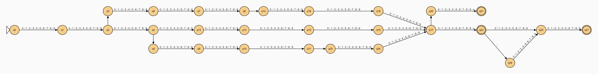

# Validador de CPF e RG com Autômato em Spring Boot

Este projeto é uma aplicação Spring Boot desenvolvida em Java que tem como objetivo validar números de CPF e RG utilizando um autômato. A aplicação conta com uma interface simples onde o usuário pode inserir um número de documento e receber a validação e o tipo de documento (CPF ou RG).

## Funcionalidades

- **Validação de CPF e RG**: O sistema valida se o número de documento inserido é um CPF ou RG válido.
- **Interface**: Uma página inicial com um campo para inserção do documento e outro para exibir o resultado da validação.
- **Autômato**: Utilização de um autômato para realizar a validação dos documentos.

## Estrutura do Projeto

O projeto está organizado da seguinte forma:

- **src/main/java**: Contém o código fonte da aplicação Spring Boot.
- **src/main/resources**: Contém os recursos estáticos, como templates HTML, imagens e arquivos JSON.

## Como Executar o Projeto

1. **Pré-requisitos**:
   - Java JDK 11 ou superior;
   - Maven instalado;
   - IDE, como Netbeans.

2. **Clonar o Repositório**:
   ```bash
   git clone https://github.com/seu-usuario/validador-cpf-rg.git
   cd validador-cpf-rg
   ```
   
3. **Compilar e Executar**:
  ```bash
  mvn clean install
  mvn spring-boot:run
  ```

4. **Acessar a Aplicação**:
Abra o navegador e acesse http://localhost:8080.

## **Ferramentas Utilizadas**:
- **Spring Boot**: Framework para desenvolvimento de aplicações Java.
- **Thymeleaf**: Motor de templates para renderização de páginas HTML.
- **Maven**: Gerenciador de dependências e build do projeto.
- **Automatarium**: Elaboração e representação do autômato (https://automatarium.tdib.xyz/)

## **Autômato**:


### **Arquivo JSON (Automatarium)**
É possível visualizar este autômato importando o [arquivo JSON](files/Autômato.json) no site Automatarium.
